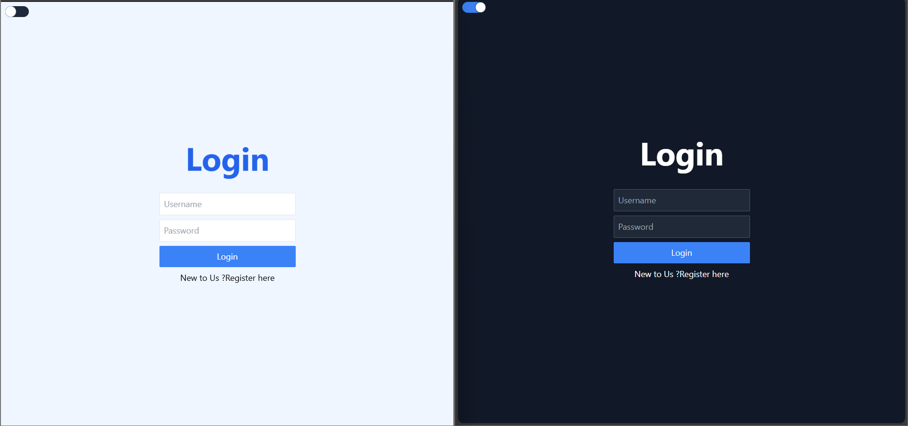
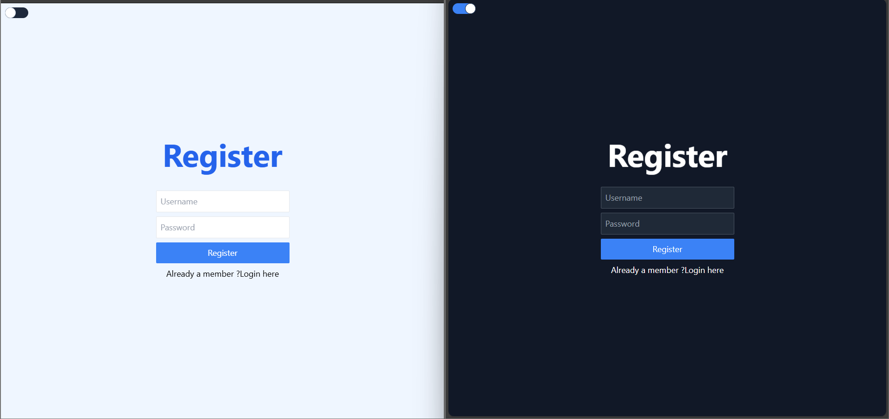
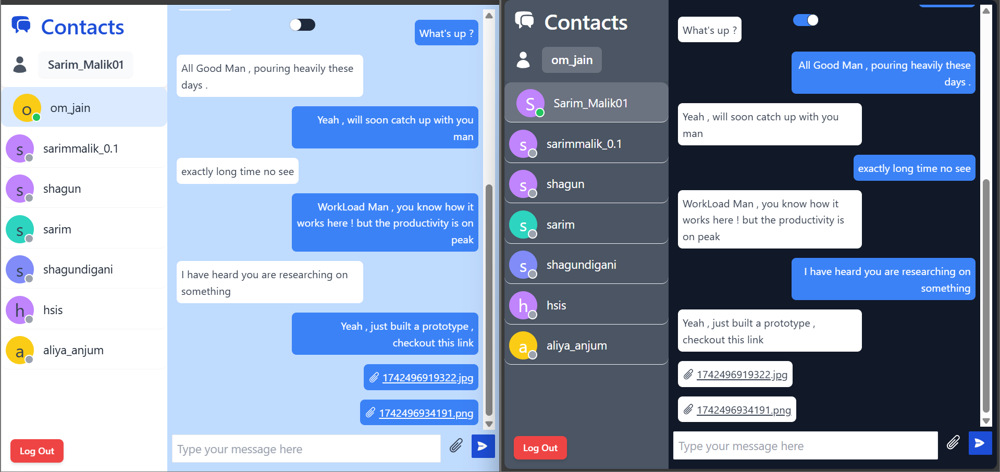
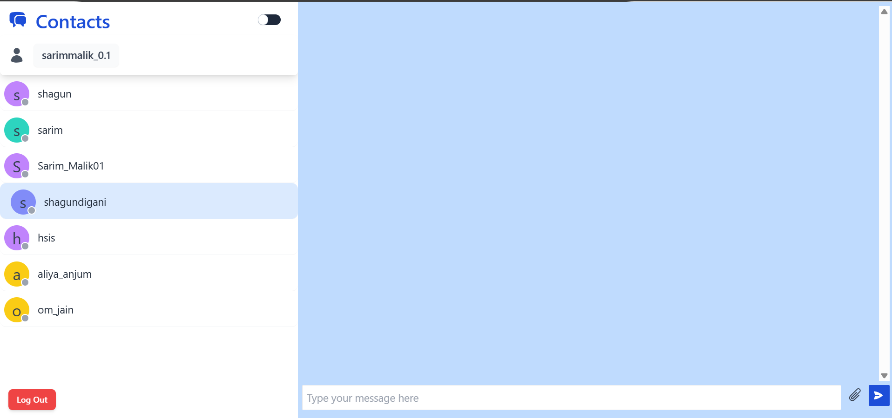

# Chat App

## 🌟 Features
### ✅ User Authentication
- Secure **Login, Register, and Logout** system.
- Passwords are securely stored using **bcrypt** to prevent unauthorized access.
- JWT-based authentication ensures only verified users can access protected routes.
- **Session management** to keep users logged in securely.

### 🌗 Theme Toggle
- Choose between **Light Mode and Dark Mode** for a personalized chat experience.
- The theme preference is **saved in local storage**, ensuring a seamless experience across sessions.
- The UI dynamically updates when toggling between themes.

### 💬 Real-time Messaging
- **Instant messaging** powered by **Socket.io**.
- **Message status indicators**: See when messages are sent, delivered, and read.
- Messages are stored in **MongoDB**, ensuring they persist even after users log out.
- **Typing indicators** show when the other user is typing.
- **Message timestamps** provide clarity on when messages were sent.

### 🟢 Online & Offline Status
- **Real-time updates** on friends' online status.
- Notifications when a friend comes **online** or goes **offline**.
- **Last seen status** for offline users.
- Users can manually set their availability status (e.g., "Busy", "Away").

### 📎 File Sharing
- Send **files as previewable links** instead of large attachments.
- Supports **images, videos, and documents**.
- Files are stored securely and can be accessed through a **generated preview link**.
- **Image previews** appear directly in the chat window.

## 🚀 Tech Stack
- **Frontend**: React, Redux, Tailwind CSS
- **Backend**: Node.js, Express.js
- **Database**: MongoDB
- **Authentication**: JWT (JSON Web Tokens)
- **WebSockets**: Socket.io for real-time chat

## 📥 Installation

### 1️⃣ Clone the Repository
```bash
git clone https://github.com/SarimMalik01/Chat_2.git
cd Chat_2
```

### 2️⃣ Install Dependencies
#### Backend
```bash
cd api
npm install
```
#### Frontend
```bash
cd client
npm install
```

### 3️⃣ Configure Environment Variables
Create a `.env` file in the backend directory and add:
```env
PORT=5000
MONGO_URI=your_mongodb_connection_string
JWT_SECRET=your_secret_key
```

### 4️⃣ Run the Application
#### Start the Backend Server
```bash
cd backend
npm start
```
#### Start the Frontend
```bash
cd frontend
npm start
```

## 🛠️ Usage
- **Sign up** or **Login** to your account.
- **Add friends** by searching their usernames.
- **Start chatting** with your friends in real time.
- **Toggle themes** for a better experience.
- **Send and receive messages** with instant updates.
- **Share files** through previewable links.
- **Check online/offline status** of friends.

## 📸 Screenshots
### Login Page


### Register Page


### Chat Interface


### Online Status


### Dark Mode


### Chat Home


### File Sharing Preview


## 📝 License
This project is open-source and available under the MIT License.

---

👨‍💻 Developed by **Sarim Malik**

